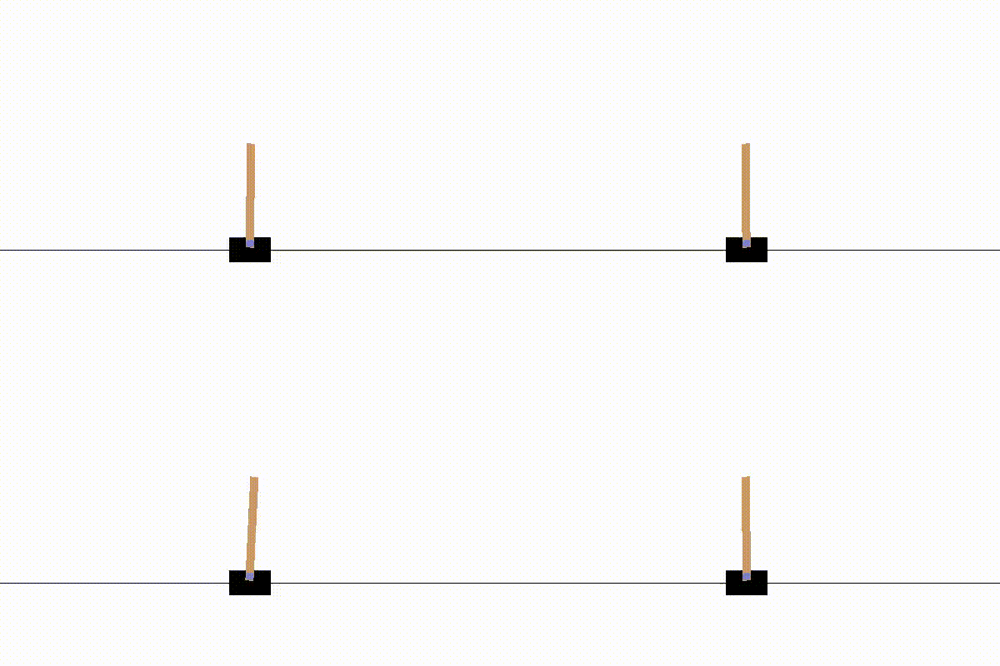
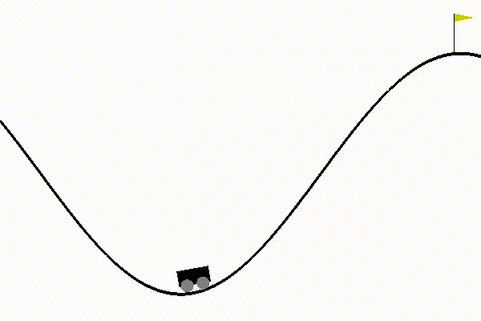

# RLExperiments

A set of simple problems solved using (D)RL

## Outline

| Task | Demo |
|------|------|
| [`CartPole-v1` using `A2C`](a2c_cartpole_v1) |  |
| [`MountainCar-v0` using `DQN`](dqn_mountaincar_v0) |  |

## Urgent issues and future work
1. *Nothing so far*

## Issues and future work
1. Feature: Implement a custom `DQN` to solve the `MountainCar_v0` environment
2. Feature: Implement a custom `policy-based` model to solve the `CartPole_v1` environment
3. Feature: Implement a custom `A2C` model to solve the `CartPole_v1` environment
4. Feature: Implement a vision-based `DQN` to solve the `MountainCar_v0` enviroment
5. Feature: Implement a vision-based `A2C` to solve the `CartPole_v1` enviroment

## Contributors
1. Hamid Mohammadi: <sandstormeatwo@gmail.com>
