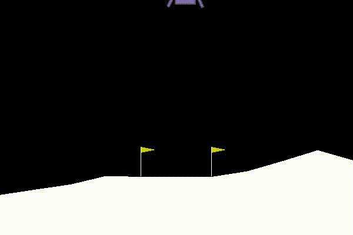

# Convolutional MountainCar v0

Solving the `MountainCar-v0` using a custom Pytorch-based `ConvolutionalDQN` agent.

The agent is `only receiving the RBG frames` of the game.

The environment is extended to apply reward shaping in order to solve this problem.



## Notice

The requirements are tested using `Python36`


## Requirements


```bash
apt install -y xvfb python-opengl libglib2.0-0

pip install --upgrade pip
pip install -r requirements.txt
```

OR

```bash
docker build -t custom_cdqn_mountaincar_v0 .
docker run -it --rm -v $(pwd):/workdir custom_cdqn_mountaincar_v0 bash
```

## Run

```bash
python main.py
```

**The output videos will be stored in the output directory*


## Urgent issues and future work

1. *Nothing so far*


## Issues and future work

1. Feature: Improve training stability
2. Bug: As you can see in the demo gif there are some situations of wrong actions; find out why
3. Feature: Make the decision resolution more by providing the previous frames as temporal dimension, not the future frames with the repeated actions


## Contributors

1. Hamid Mohammadi: <sandstormeatwo@gmail.com>
