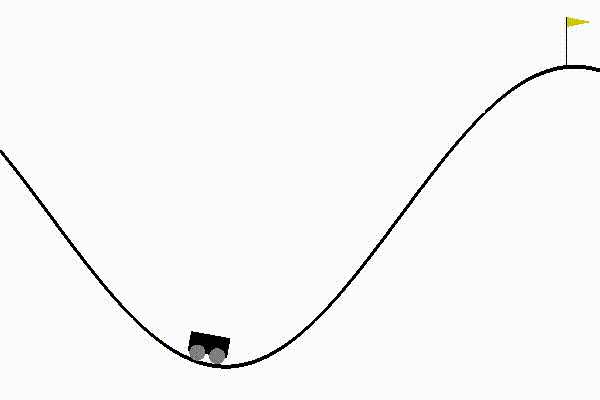

# MountainCar v0

Solving the `MountainCar-v0` using a custom Pytorch-based ' `DQN` agent.

The environment is extended to apply reward shaping in order to solve this problem.



## Notice

The requirements are tested using `Python36`


## Requirements


```bash
apt install -y xvfb python-opengl

pip install --upgrade pip
pip install -r requirements.txt
```

OR

```bash
docker build -t custom_mountaincar_v0 .
docker run -it --rm -v $(pwd):/workdir custom_mountaincar_v0 bash
```

## Run

```bash
python main.py
```

**The output videos will be stored in the output directory*


## Urgent issues and future work
1. *Nothing so far*


## Issues and future work
1. *Nothing so far*


## Contributors

1. Hamid Mohammadi: <sandstormeatwo@gmail.com>
